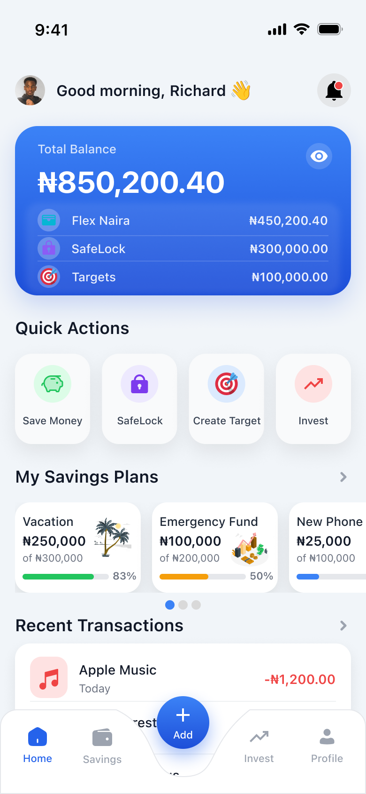
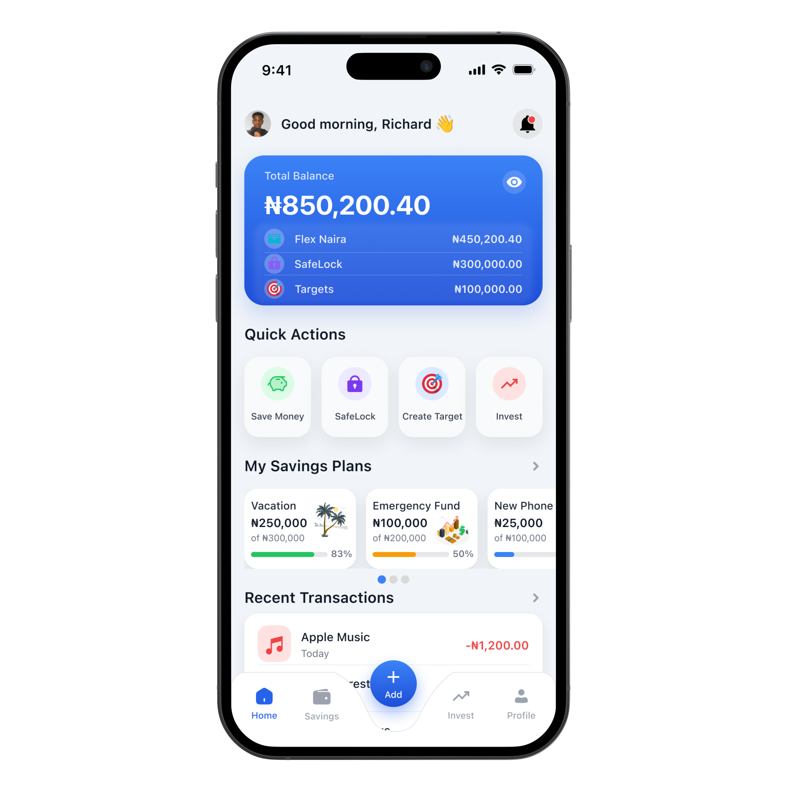
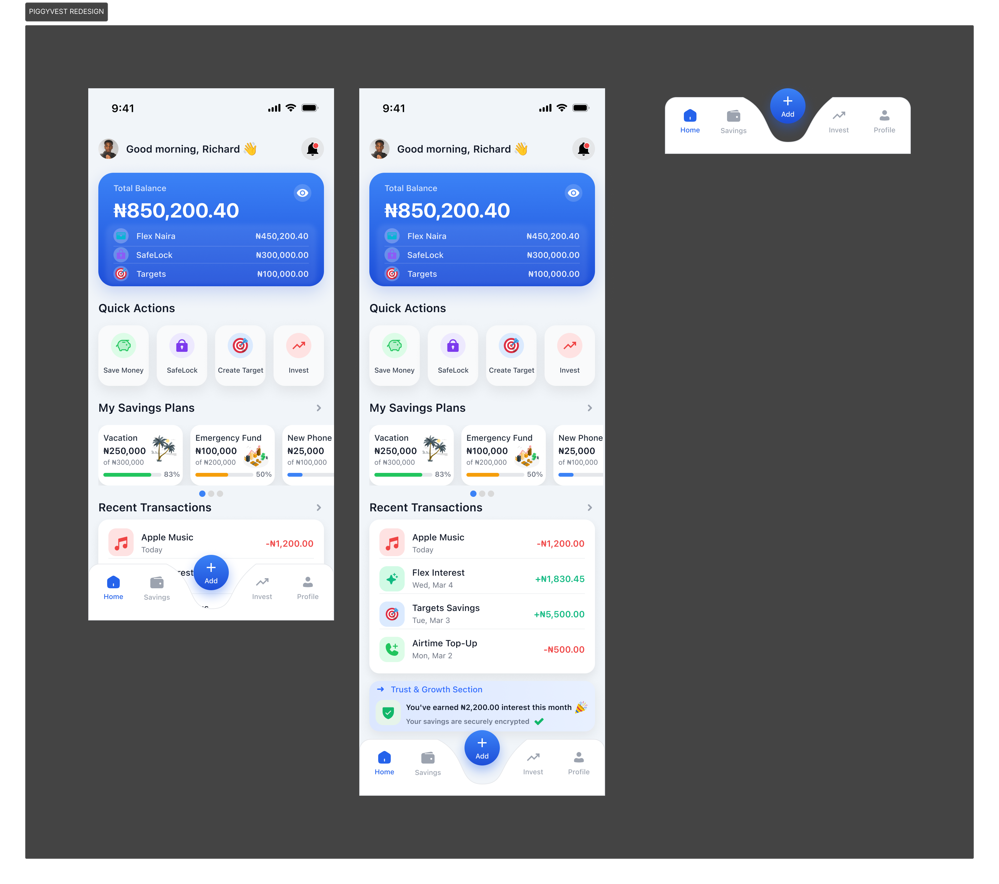

# PiggyVest Mobile App Redesign

## Project Overview

This project is a redesign of the PiggyVest mobile application interface.
The goal of this redesign was to create a cleaner, more user-friendly layout that improves usability and visual appeal while maintaining the core features of the PiggyVest platform.

## Design Goals

* Improve visual hierarchy
* Make navigation easier for users
* Create a modern mobile interface
* Maintain the familiar PiggyVest brand style

## Tools Used

* Figma
* UI/UX Design Principles
* Mobile Design Guidelines

## Homepage Design

## App Mockup

## Full UI Layout

## What I Learned

During this project, I practiced designing mobile interfaces, organizing layouts for better usability, and creating visually balanced UI components.

## Author

Created by [Adu Richard Olaife]
